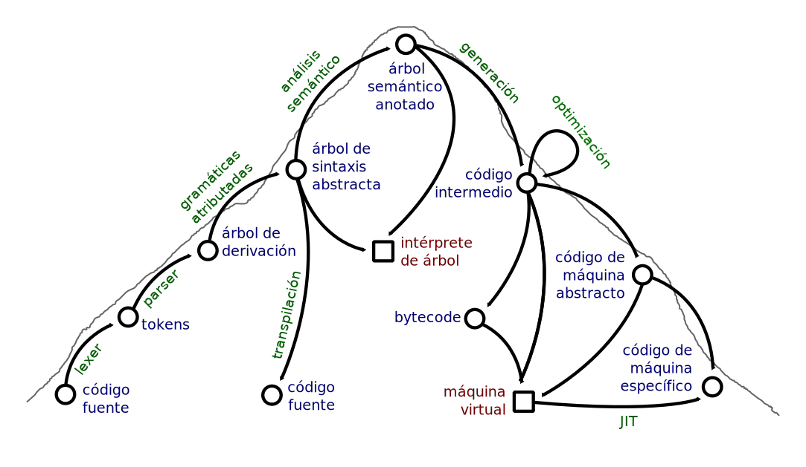

# Introducción a la Compilación

## ¿Qué esperan aprender en la asignatura?

. . .

- Reconocer problemas típicos de compilación y teoría de lenguajes.
- Crear reconocedores y generadores de lenguajes.
- Entender el funcionamiento de un compilador.
- Saber cómo se implementan instrucciones de alto nivel.
- Diseñar lenguajes de dominio específico.
- Poder implementar intérpretes y compiladores de un lenguaje arbitrario.
- Entender las diferencias y similaridades entre lenguajes distintos.
- Conectar lenguajes de alto nivel con arquitecturas de máquina.
- Aprender técnicas de procesamiento de lenguaje natural.

## ¿Por qué hizo falta esta ciencia?

> Al principio, no había compiladores...

### Primeros pasos

- 1952: A-0, Grace Hooper
- 1957: FORTRAN, John Backus
- 1958: ALGOL, Friedrich Bauer
- 1960: COBOL, Grace Hooper (primer compilador "multiplataforma" para UNIVAC II y RCA 501)

> En este punto, los compiladores se volvieron demasiado complicados para hacerlos a mano, y hubo que "hacer ciencia"...

## ¿Qué estudia entonces la compilación?

. . .

> **¿Cómo hablar con las computadoras?**

- ¿Qué tipos de lenguajes es capaz de *entender* una computadora?
- ¿Cuánto de un lenguaje debe ser *entendido* para poder entablar una conversación?
- ¿Qué es *entender* un lenguaje?
- ¿Es igual de fácil o difícil *entender* que *hablar* un lenguaje?
- ¿Podemos caracterizar los lenguajes en términos computacionales según su complejidad para ser *entendidos* por una computadora?
- ¿Cómo se relacionan estos lenguajes con el lenguaje humano?

## ¿Qué estudia entonces la compilación?

> **¿Cómo hablar con las computadoras?**

- ¿Qué podemos aprender sobre la naturaleza de las computadoras y los problemas computables, a partir de los lenguajes que son capaces de reconocer?
- ¿Qué podemos aprender sobre el lenguaje humano para hacer más inteligentes a las computadoras?
- ¿Qué podemos aprender sobre el lenguaje humano, y la propia naturaleza de nuestra inteligencia, a partir de estudiar los lenguajes entendibles por distintos tipos de máquinas?

## ¿Qué es un compilador?

> Depende de a quién le preguntes...

\ { width=100% }

## ¿Qué vamos a aprender en el curso?

### Tema 1: Lenguajes

- Teoría de lenguajes formales (autómatas, gramáticas, ...)
- Algoritmos de reconocimiento y _parsing_

### Tema 2: Semántica

- Contextos y consistencia del uso de símbolos
- Consistencia e inferencia de tipos

### Tema 3: Arquitectura

- Generación de código de máquina
- Máquinas virtuales, manejo de memoria
- Optimización de código

## ¿Cómo lo vamos a aprender?

> Este curso no es _top-down_ ni _bottom-up_, sino todo lo contrario ;)

### Algunas reglas básicas

- La guía del curso es la construcción de un compilador
- En las clases prácticas **hay** que programar
- Desde el primer día estaremos compilando "algo"
- Cada clase práctica añadiremos algo nuevo al lenguaje
- Las conferencias no lo dicen todo
- Los contenidos se introducen a medida que se complejizan las clases prácticas

## ¿Cómo lo vamos a aprender?

> Durante todo el curso nos basaremos en el lenguaje **COOL** (Class Object-Oriented Language)

- Orientado a objetos
- Herencia simple, polimorfismo
- Clases, atributos y métodos
- Operaciones aritméticas y lógicas
- Tipos básicos `Int`, `Bool`, `String`
- Jerarquía de tipos unificada
- Control de flujo (`if`, `while`)
- Ámbito léxico y explícito
- Casi todo es una expresión
- Casting explícito
- Recolección de basura

## ¿Cómo lo vamos a aprender?

### Un "Hola Mundo" algo edulcorado en **COOL**

```ruby
class Message inherits IO {
    sayHello(who: String) : Object {
        let greeting: String <- "Hello " in {
            out_string(greeting);
            out_string(who);
        }
    };
};

class Main {
    main(): Object {
        new Message.sayHello("World!")
    };
};
```

## ¿Cómo lo vamos a evaluar?

- El examen final tiene 6 preguntas, 2 de cada tema.
- En cada pregunta se puede obtener **suficiente** o **excelente**
- Es imprescindible obtener **suficiente** en las 6 preguntas para aprobar.
- Es necesario obtener **excelente** en las 6 preguntas para terminar con 5.

##  Pero no es tan difícil

- Durante el curso hay 3 examenes parciales y 3 proyectos.
- Un proyecto con **excelente** convalida ambas preguntas del tema con **excelente**.
- Un examen parcial con **excelente** convalida una pregunta del tema con **excelente** y otra con **suficiente**.
- Un proyecto con **suficiente** convalida con suficiente ambas preguntas del tema.
- Un examen parcial con **suficiente** convalida una pregunta del tema con **suficiente**.
- Excepcionalmente, los estudiantes con un desempeño impecable en clases prácticas pueden recibir bonificaciones adicionales.

## Para la clase práctica

> Vamos a hacer un evaluador de expresiones

### Requisitos

- Python 3
- Jupyter Notebook
- Acordarse de primer año

## En conclusión

- Todo lo que hagan cuenta a su favor.
- Siempre será peor no hacer una evaluación que hacerla mal.
- Es posible obtener excelente sin llegar al exámen final (y se lo aconsejamos).
- Una acumulación de resultados mediocres no suma un resultado excelente.
- Nunca es demasiado tarde para tener éxito, pero cada vez cuesta más.
- Cualquiera se cae una, dos, tres veces, pero hay que levantarse.

